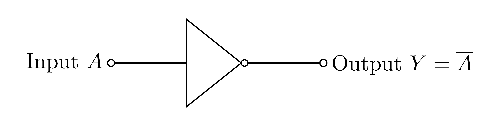
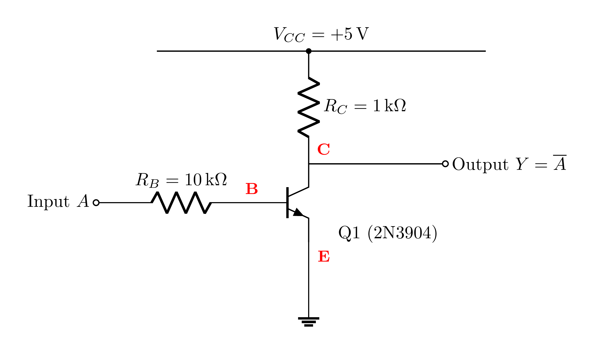
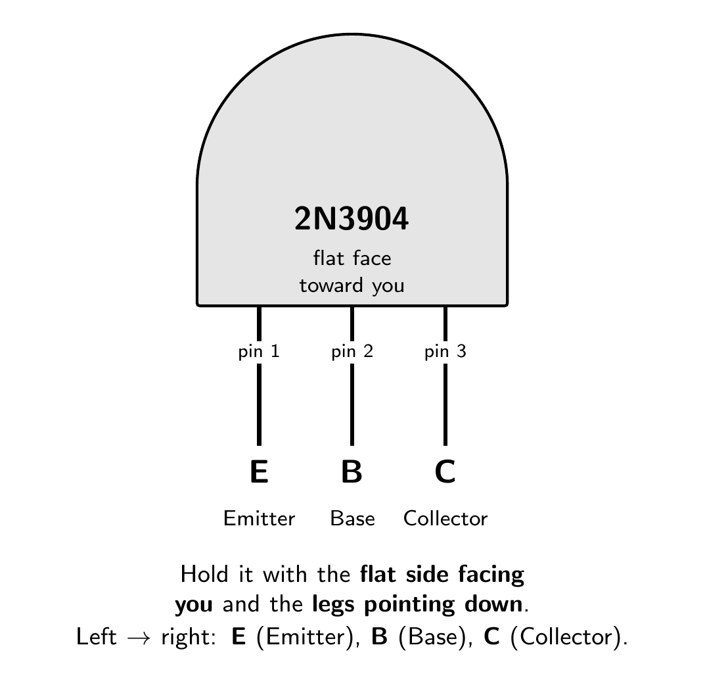
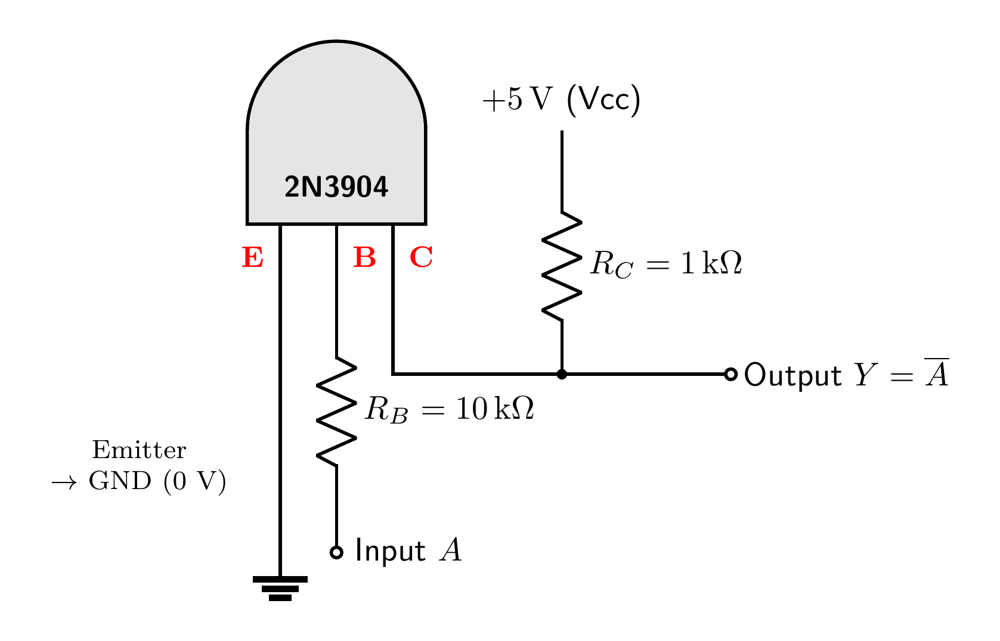

# NOT Gate

A NOT gate **outputs the opposite of its input** (`Y = Ā`). It is the most basic
active logic gate, and the building block for every other gate.

### Symbol

A triangle with a small **bubble** on the output. The bubble always means *inversion*.



### Truth table

| Input `A` | Output `Y` |
|:---------:|:----------:|
| 0 | 1 |
| 1 | 0 |

---

## What `0` and `1` really mean

`0` is **not** an empty wire. Both levels are real voltages the output is connected to:

| Level | Connected to | Voltage |
|:-----:|:-------------|:-------:|
| `1` (HIGH) | the supply rail **Vcc** | `+5 V` |
| `0` (LOW)  | **ground (GND)**          | `0 V`  |

So `0` means the output is **actively pulled down to ground (0 V)** through a conducting
transistor, not "no electricity." A wire connected to *nothing* is a third, undefined
state called **floating**, which we always avoid.

---

## How it is built

A single **common-emitter NPN stage**: emitter to ground, collector pulled up to `+5 V`
through a resistor, output taken at the collector.



How it works:

- **Input `1` (+5 V):** the transistor turns ON (saturated) and conducts, so the collector
  is **pulled down to ground** → output `0`.
- **Input `0` (0 V):** the transistor is OFF, no current flows in `R_C`, so the collector is
  **pulled up to +5 V** → output `1`.

That is exactly the inverting behaviour `Y = Ā`. (Two of these stages in series make a
[buffer](https://github.com/mrmhmdalmalki/buffer-gate).)

---

## Building it on a breadboard

The schematic shows the *electrical* layout (Vcc on top, ground on the bottom, by
convention). On a real breadboard, `+5 V` and `GND` are just **rails**: it does not matter
whether the +5 V rail is along the top or the bottom of the board. `+5 V` and `GND` are
**nodes** (named connections), not physical positions. That is why a build that takes +5 V
from the bottom rail still works exactly the same.

What you *do* have to get right is **which leg of the transistor is which**. For the 2N3904,
hold it with the **flat face toward you and the legs pointing down**; the legs are then
**E, B, C** from left to right:



Now connect each leg as below. This is the same circuit as the schematic, just drawn the way
the part actually sits in front of you:



| 2N3904 leg (flat face toward you) | Connect it to |
|:----------------------------------|:--------------|
| **E** (Emitter, left)    | **GND** (0 V) |
| **B** (Base, middle)     | through **R_B (10 kΩ)** to the **Input** |
| **C** (Collector, right) | through **R_C (1 kΩ)** to **+5 V**; this same node is the **Output** |

Quick test once wired: Input tied to **+5 V** should give Output near **0 V**; Input tied to
**GND** should give Output near **+5 V**. If it is reversed or stuck, the most common cause is
the transistor legs being in the wrong holes, so re-check E/B/C against the pinout above.

---

## Components

### Transistor: 2N3904  (×1: Q1)

- **Type:** **NPN** *bipolar junction transistor* (BJT), a current-controlled switch: a
  small current into the **base** lets a much larger current flow from **collector** to
  **emitter**. Here it is used fully on/off, as a switch.
- **Package:** TO-92 (small black half-cylinder of plastic with 3 legs).
- **Pinout:** hold it with the **flat face toward you and the legs pointing down**, and the pins
  are **E, B, C** (Emitter, Base, Collector) from left to right.
- **Key ratings:** V_CE ≈ **40 V** max, I_C ≈ **200 mA** max, current gain *hFE* ≈ **100–300**.
- **Why NPN (not PNP)?** The emitter sits at **ground**, so a HIGH (+5 V) on the base turns
  the transistor ON and drags the output **down to ground**. A PNP works upside-down
  (emitter at +5 V, on when the base is LOW) and would need the circuit re-wired.
- **Substitutes:** 2N2222, PN2222, BC547, or any general-purpose NPN. **Re-check the pinout.**

### Resistors

| Ref | Value | Job |
|:---:|:-----:|:----|
| R_B | **10 kΩ** | **Base resistor**, limits base current to a safe level while still switching the transistor fully on (`I_B ≈ (5 − 0.7)/10k ≈ 0.43 mA`). |
| R_C | **1 kΩ**  | **Collector pull-up**, provides the HIGH (+5 V) level and limits current when the transistor pulls the output low (`I_C ≈ (5 − 0.2)/1k ≈ 4.8 mA`). |

### Power

- A **+5 V** supply rail and a common **GND** (0 V) reference.

---

## Standards and references

**Gate symbol.** The distinctive-shape symbol follows the ANSI/IEEE standard for logic graphic symbols:

- IEEE Std 91-1984 and 91a-1991, *Graphic Symbols for Logic Functions* ([standards.ieee.org](https://standards.ieee.org/ieee/91_91a/241/)). The distinctive shapes originate from US MIL-STD-806; the international equivalent is IEC 60617-12.
- Free explainer: Texas Instruments, *Overview of IEEE Standard 91-1984* (PDF) ([ti.com](https://www.ti.com/lit/ml/sdyz001a/sdyz001a.pdf)).
- Symbols and truth tables overview: *Logic gate*, Wikipedia ([wikipedia.org](https://en.wikipedia.org/wiki/Logic_gate)).

**Transistor circuit.** This NOT gate is a single common-emitter RTL stage: an input base resistor driving the base, and a collector pull-up resistor to +5 V. It follows standard transistor switch logic / RTL:

- *Resistor-Transistor Logic (RTL)*, Wikipedia ([wikipedia.org](https://en.wikipedia.org/wiki/Resistor%E2%80%93transistor_logic)).
- *NOR and NAND gates using transistor*, TheoryCircuit ([theorycircuit.com](https://theorycircuit.com/digital-electronics/nor-and-nand-gates-using-transistor/)).
- *Logic Gates using Transistors*, Electronics Tutorials ([electronics-tutorials.ws](https://www.electronics-tutorials.ws/logic/logic-gates-using-transistors.html)).
- P. Horowitz and W. Hill, *The Art of Electronics*, 3rd ed., Cambridge University Press, 2015 (the BJT used as a switch).
- A. S. Sedra and K. C. Smith, *Microelectronic Circuits*, Oxford University Press (BJT switch and the logic NOT gate).
- T. L. Floyd, *Digital Fundamentals*, Pearson (logic-gate symbols and truth tables).

**Transistor part.** 2N3904 NPN, onsemi datasheet ([PDF](https://www.onsemi.com/pdf/datasheet/2n3904-d.pdf)), product page ([onsemi.com](https://www.onsemi.com/products/discrete-power-modules/general-purpose-and-low-vcesat-transistors/2n3904)).

**Highlighted source (additional).** The exact building block this design uses, scroll-to-text highlighted on the Wikipedia RTL page: [“a common-emitter stage with a base resistor”](https://en.wikipedia.org/wiki/Resistor%E2%80%93transistor_logic#:~:text=common-emitter%20stage%20with%20a%20base%20resistor).

---

## Regenerating the diagrams

```bash
pdflatex circuit.tex
pdflatex symbol.tex
pdftoppm -png -r 600 circuit.pdf images/circuit   # -> images/circuit-1.png
pdftoppm -png -r 600 symbol.pdf  images/symbol     # -> images/symbol-1.png
```

> Use `pdftoppm`, not `pdftocairo`, at high DPI the Cairo backend can garble the fonts.
